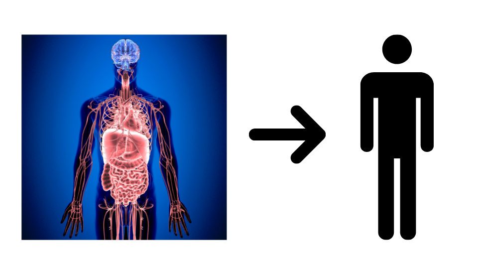
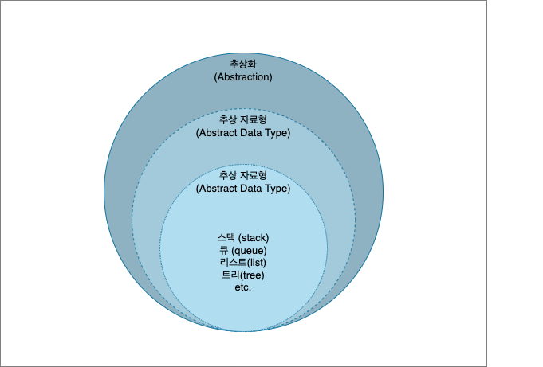
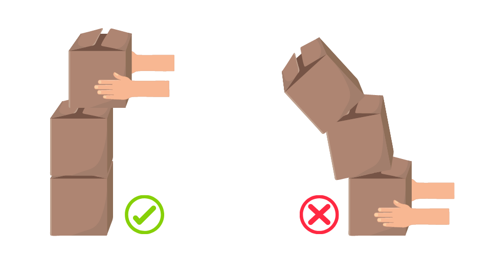

# 스택(Stack)

## 목차(Contents)

### [1. 스택(Stack)이란?](#스택stack이란)
### [2. `std::stack` 클래스]
+ [멤버 타입 (Member types)]
+ [멤버 함수 (Member functions)]
  + [OCF (Orthodox Canonical Form)]
  + [Iterator]
  + [Element access]
  + [Modifiers]
+ [비-멤버 함수 (Non-menber Function)]
### [3. 참고 자료 (Reference)](#reference)
---

# 추상화, 추상 자료형, 자료구조


<!--  -->

<!-- > 추상 : 여러 가지 사물이나 개념에서 공통되는 특성이나 속성 따위를 추출하여 파악하는 작용. <sup>[1] -->

`컴퓨터 프로그래밍`은 현실에 존재하는 문제나 대상을 디지털 셰계로 옮겨와 컴퓨터의 연산능력을 통해 해결하고 표현하기 위한 방법입니다. 인간은 문제 해결을 위해 다채롭게 현실 세계를 인지하고, 논리적이거나 직관적인 사고를 할 수 있지만, 컴퓨터는 `0`과 `1`로 이루어진 전기 신호, 즉 `2진 구조`를 같는 `비트`단위를 최소 단위로 일련의 연산을 수행합니다.

> 사실 0과 1 이진 표현도 인간이 이해하기 쉽도록 표현한 방식입니다. 조금 더 정확하게 표현하면 컴퓨터는 자신을 구성하고 있는 회로의 전압차이를 통해 2가지 상태에 대한 정보를 얻습니다. 예를 들면 회로에 5v 전압이 흐르면 `1`, 전압이 0v 이거나 접지 전압이면 `0`으로 인식하는 방식입니다.

컴퓨터가 처리할 수 있는 정보는 0과 1 두 가지 뿐이라는 점에서 굉장히 단순하지만, 컴퓨터는 인간의 두뇌로는 처리하기 힘든 막대한 양의 정보를 순식간에 처리할 수 있습니다. 하지만 이런 연산 능력을 활용하기 위해서는 컴퓨터에게 우리가 다루고자 하는 `대상`이나 원하는 `동작`을 `재정의` 하고, 재정의된 개념을  컴퓨터가 처리가능한 방식으로 `구현`하는 과정이 필요합니다. 이 과정이 바로 `프로그래밍`입니다.

<p align="center">

</p>
<p align="center">
애니악 프로그래밍,
 <a href="https://media.gettyimages.com/photos/computer-operators-program-eniac-the-first-electronic-digital-by-picture-id615303458?s=2048x2048">© CORBIS/Corbis via Getty Images</a>
</p>

`애니악(ENIAC)`과 같은 초기 컴퓨터는 외부로 들어난 스위칭 소자 배선판에 선을 결선해 연산을 수행하는 방식을 사용했습니다. 예를 들어 어떤 값을 더한 뒤 곱셈을 하고 싶다면,  하지만 이후 `폰 노이만 구조`에 따라 설계된 현대식 컴퓨터들은 `중앙 처리 장치(CPU)`, `메모리(Memory)`, `대용량 저장장치(Storage)`, `입출력 장치(I/O)`를 갖는 범용 컴퓨터로써 프로그램 내장 방식으로 동작하게 되었고, 자연스럽게 `프로그래밍 언어(Language)`의 등장으로 이어집니다.


컴퓨터 공학에서 `추상화(Abstraction)`란, 특정 대상이 가지고 있거나, 혹은 가져야 하는 필수적이고 핵심적인 특징들을 정의하는 하는 것을 말합니다. 조금 더 구체적으로는 `인터페이스` 역할을 하는 `모델`을 만드는 것과 같습니다.


구체적 상황을 예시로 이해해보겠습니다.

어느날 우리 앞에 `컴퓨터`라고 불리는 놀라운 기계가 등장했습니다. 이 컴퓨터는 일련의 데이터들을 `입력` 받아 특정 동작을 수행하고 출력해주는 기계입니다.

우리는 컴퓨터에 입력값을 전달 해주는 새로운 장치를 만들고자 합니다. 이 장치가 가져야 하는 핵심적인 특징은 다음과 같습니다.

1. 컴퓨터에 `연결`해 입력 `데이터`를 `전달`할 수 있어야 한다.
   
2. 데이터는 사람이 `물리적`으로 `입력`한다.

네 이미 아시겠지만 이 장치는 `키보드(keyboard)`입니다.

위의 요구 사항을 바탕으로 키보드를 추상화 시킨 모델은 아래와 같습니다.

키보드는 물리적으로 컴퓨터와 연결할 수 있는 연결부와 사용자로 부터 입력 받을 수 있는 입력부, 입력을 전달할 전송부를 반드시 가져야 하고, 컴퓨터와 `연결`하고 컴퓨터로 데이터를 전달할 수 있는 `사용자 입력`과 `데이터 전송`이라는 동작들을 수행 할 수 있어야 합니다. 이는 모든 키보드가 최소한 공통적으로 가져야하는 `인터페이스(interface)`이자 `명세(specification)`입니다.

이처럼 대상의 핵심적인 특징을 정의하는 과정이 `추상화`이고, 추상화를 통해 정의된 특징들을 기준에 따라 분류해서 계층적으로 표현한 것을 `추상화 계층(Abstraction Layer)`이라고 합니다. 추상화나 추상화 계층은 어떤 수준 까지 어떤 기준으로 구조화 하냐에 따라서 정말 다양하게 나타 날 수 있습니다.

예를 들어 키보드의 `Connect`라는 핵심 기능은 조금 더 세부적으로 추상화 했을 때, `연결 대상 확인`, `연결 방식 확인` 등으로 확장 시킬 수 있고, `Input`은 `언어별 입력`, `특수 문자 입력`, `매크로 입력` 등 추가적인 정의를 내릴 수 도 있습니다. 또한 LED가 설치된 키보드의 경우에는 `Led control` 역시 추가로 정의 할 수 있습니다.

위의 추상화 계층구조는 기계적 관점에서 인터페이스와 기능적 관점에서의 인터페이스로 구분해서 표현한 구조입니다. 따라서 소프트웨어 엔지니어는 위의 추상화된 모델을 바탕으로 핵심 기능을 `구현(Implementation)`하게 되는데, 이 과정이 곧 `프로그래밍`입니다. `키보드`와 같은 `하드웨어` 입출력 기기의 소프트웨어는 `펌웨어(Firmware)`와 `장치 드라이버(Device Driver)`로 구성되어있고, 해당 프로그램은 기가가 정의된 동작을 수행 할 수 있게끔 구현되어 있습니다.


우리가 하z4x는 `프로그래밍`은 현실의 `문제`를 해결하기위해, 문제 해결 방법을 체계적으로 구성해 컴퓨팅 시스템이 효율적으로 처리할 수 있도록 `프로그램`을 작성하는 것입니다.


`스택(Stack)`은 `추상적 자료형(Abstract Data Type, ADT)`이자  `자료구조`의 한 종류로써 사용되고 있습니다.





# `스택(Stack)`이란?


추상화란 어떤 종류의 대상들에 대해 그것이 가져야 할 핵심적인 특징들을 가지는 모델을 만드는 것.
추상적 자료형이란 자료들과 이 자료들에 대한 연산(동작, behavior)을 수학적으로 정의한 이론적인 형태를 말합니다. 

따라서, `C++ 스택 컨테이너` 재구현이 목표인 이번 프로젝트를 진행하기 위해서는 추상적 자료형 스택의 이론적 개념과 이 개념을 바탕으로 구현된 자료구조 스택이라는 두 관점에서 개념을 이해할 필요가 있습니다.

---
## 추상적 자료형 : 스택(Stack as a data structure)


`스택(stack)`은 `후입선출(LIFO, Last-Input-First-Out)`
## `C++ STL 컨테이너`의 스택(Stack as a STL Container)
content...

# `std::stack` 클래스


+ `T`

+ `Allocator`

---
## 멤버 타입(Member types)

```c++
// Stack Synopsis


```


---
## 멤버 함수(Member Function)

### OCF(Orthodox Canoical Form)

#### 생성자 (Constructor)

#### 소멸자 (Destructor)
  
```c++
~stack(void)
```

#### 복사 대입 연산자 (Copy Assignment Operator)

```c++
stack& operator=(const stack& x);
```
---
### Capacity

---
### Element access


---
### Modifiers
---
## 비-멤버 함수 (Non-menber Function)
---
## Reference

+ ["PROGRAMMING THE ENIAC: AN EXAMPLE OF WHY COMPUTER HISTORY IS HARD", Leonard J. Shustek, last modified May 18, 2016, accessed May 06, 2022](https://computerhistory.org/blog/programming-the-eniac-an-example-of-why-computer-history-is-hard/)
+ ["Binary Numbers", electronics-tutorials, last modified Dec 05, 2021, accessed May 06, 2022](https://www.electronics-tutorials.ws/binary/bin_1.html)
+ ["추상화", namu wiki, last modified Feb 08, 2022, accessed May 06, 2022](https://namu.wiki/w/%EC%B6%94%EC%83%81%ED%99%94)
+ ["Abstraction (computer science)", Wikipedia, last modified Jan 21, 2022, accessed May 06, 2022](https://en.wikipedia.org/wiki/Abstraction_(computer_science))

index|title | author | last modified | accessed | url status
-|-|-|-|-|-
[1](https://computerhistory.org/blog/programming-the-eniac-an-example-of-why-computer-history-is-hard/)|[PROGRAMMING THE ENIAC: AN EXAMPLE OF WHY COMPUTER HISTORY IS HARD](https://computerhistory.org/blog/programming-the-eniac-an-example-of-why-computer-history-is-hard/)|Leonard J. Shustek|May 18, 2016|May 06, 2022 | ok
2|[Binary Numbers](https://www.electronics-tutorials.ws/binary/bin_1.html)|electronics-tutorials.ws|Dec 05, 2021|May 06, 2022|ok


