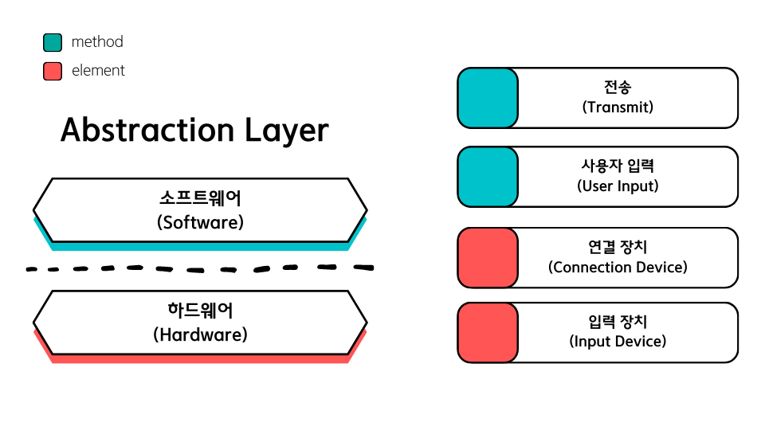

# 스택(Stack)

## 목차(Contents)

### [1. 스택(Stack)이란?](#스택stack이란)
### [2. `std::stack` 클래스]
+ [멤버 타입 (Member types)]
+ [멤버 함수 (Member functions)]
  + [OCF (Orthodox Canonical Form)]
  + [Iterator]
  + [Element access]
  + [Modifiers]
+ [비-멤버 함수 (Non-menber Function)]
### [3. 참고 자료 (Reference)](#reference)
---

# 추상화, 추상 자료형, 자료구조

> 추상 : 여러 가지 사물이나 개념에서 공통되는 특성이나 속성 따위를 추출하여 파악하는 작용. <sup>[1]

컴퓨터 공학에서 `추상화(Abstraction)`란, 특정 대상이 가지고 있거나, 혹은 가져야 하는 핵심적인 특징들을 수학적으로 정의하는 하는 것을 말합니다.

어느날 우리 앞에 `컴퓨터`라고 불리는 놀라운 기계가 등장했습니다. 이 컴퓨터는 일련의 데이터들을 `입력` 받아 특정 동작을 수행하고 출력해주는 기계입니다.

우리는 컴퓨터에 입력값을 전달 해주는 새로운 장치를 만들고자 합니다. 이 장치가 가져야 하는 핵심적인 특징은 다음과 같습니다.

1. 컴퓨터에 연결해 입력 데이터를 전달할 수 있어야 한다.
   
2. 데이터는 사람이 입력한다.

위의 요구 사항을 바탕으로 추상화 시킨 모델을 만들어 보면 아래와 같습니다.

물리적 특성 (Hardware) | 기능적 특성 (Software)
-|-
연결 장치(Connector)|전송(Transport)
입력 장치(Input )|입력(Input)




우리가 하z4x는 `프로그래밍`은 현실의 `문제`를 해결하기위해, 문제 해결 방법을 체계적으로 구성해 컴퓨팅 시스템이 효율적으로 처리할 수 있도록 `프로그램`을 작성하는 것입니다.


`스택(Stack)`은 `추상적 자료형(Abstract Data Type, ADT)`이자  `자료구조`의 한 종류로써 사용되고 있습니다.


# `스택(Stack)`이란?


추상화란 어떤 종류의 대상들에 대해 그것이 가져야 할 핵심적인 특징들을 가지는 모델을 만드는 것.
추상적 자료형이란 자료들과 이 자료들에 대한 연산(동작, behavior)을 수학적으로 정의한 이론적인 형태를 말합니다. 

따라서, `C++ 스택 컨테이너` 재구현이 목표인 이번 프로젝트를 진행하기 위해서는 추상적 자료형 스택의 이론적 개념과 이 개념을 바탕으로 구현된 자료구조 스택이라는 두 관점에서 개념을 이해할 필요가 있습니다.

---
## 추상적 자료형 : 스택(Stack as a data structure)


`스택(stack)`은 `후입선출(LIFO, Last-Input-First-Out)`
## `C++ STL 컨테이너`의 스택(Stack as a STL Container)
content...

# `std::stack` 클래스


+ `T`

+ `Allocator`

---
## 멤버 타입(Member types)

```c++
// Stack Synopsis


```


---
## 멤버 함수(Member Function)

### OCF(Orthodox Canoical Form)

#### 생성자 (Constructor)

#### 소멸자 (Destructor)
  
```c++
~stack(void)
```

#### 복사 대입 연산자 (Copy Assignment Operator)

```c++
stack& operator=(const stack& x);
```
---
### Capacity

---
### Element access


---
### Modifiers
---
## 비-멤버 함수 (Non-menber Function)
---
## Reference

